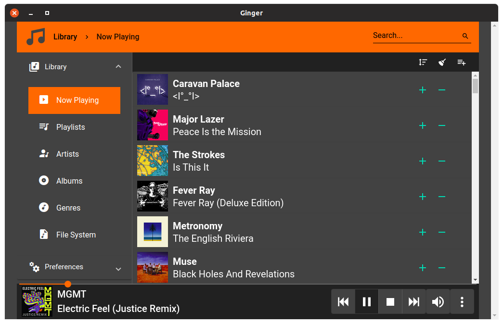
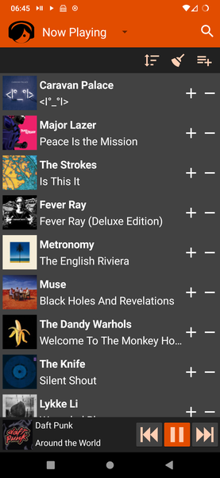
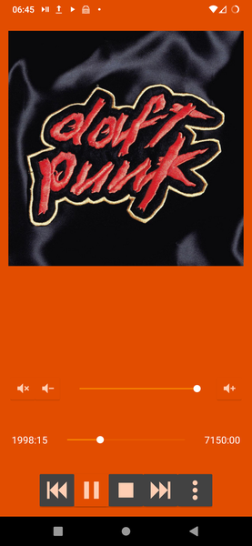

# ginger

This project came about because I could not find an MPD/Mopidy client that looked good
and was simple enough for my mother to use. We're a family of gingers, hence the name.

ginger is sleek, modern and simple (long press/right click menus are the enemy of tech-illiterate).
ginger runs virtually anywhere, desktop, mobile, you name it.
However using platform specific builds adds nice integration features (currently MPRIS integration
on Linux and media notifications on Android).
While ginger can be built for any platform, official builds currently exist only for
self-hosted web app, Linux electron app (snap and AppImage) and NativeScript Android app.

Windows builds with integration features should come in near future.

## Notes

### Mopidy

Not every Mopidy extension implements all of Mopidy core API, therefore depending on the extensions installed some views may be empty.

### MPD

MPD uses TCP sockets to communicate with clients, while ginger runs entirely client-side (think web browser) so it can only make websocket connections.
That means you need a websocket bridge like [websockify](https://github.com/novnc/websockify).
Also note that the library ginger uses to communicate with MPD is not yet compatible with latest versions of websockify, therefore you should stick to version < 0.9.0.

## Installation

### WebApp

Download ginger@1.0.0.zip, extract it, serve the directory with e.g. nginx and point you web browser to index.html

### Linux

Download Ginger-1.0.0.AppImage and run it. No installation needed.

### Android

Currently the ginger@1.0.0.apk is only available on releases page, I do plan to release it to Play Store and f-droid eventually.
